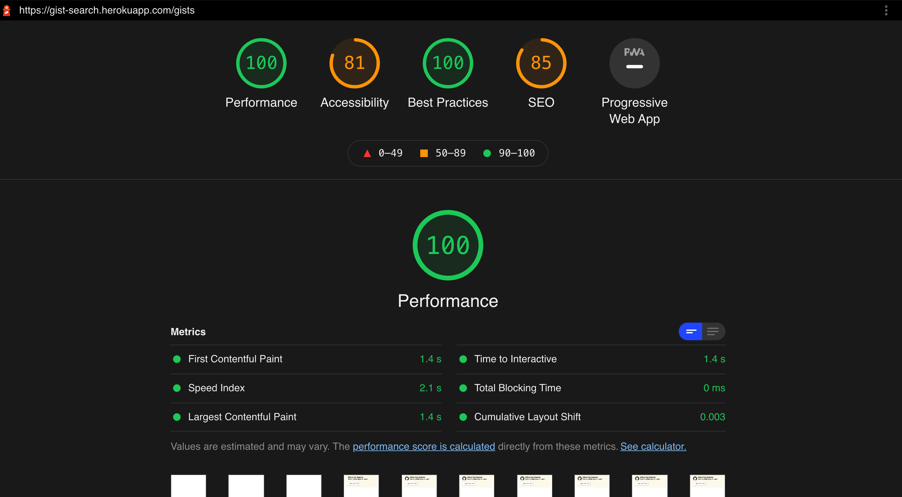

# Github Gist Search [Deployed to Heroku](https://gist-search.herokuapp.com)
The solution provides a web interface to user's to search for any users all gists it also exposes the REST Endpoint for same.
Some key features are [well documented API swagger](https://gist-search.herokuapp.com/api-docs/), [application metrics dashboard](https://gist-search.herokuapp.com/appmetrics-dash),

## To Run Locally

```bash
clone the repo, install dependencies and npm run server and npm run client to run locally.
```

## Frontend

<p align="center">
  
  <h3 align="center">Lighthouse Audit Report</h3>
</p>

```
typescript
react, react-router
redux, redux-thunk
Vanilla CSS
```
Implemented the basic functionality of search across users and repositories, added `skeleton loading` to avoid loaders and blank page.

#### Trade-off
UX for cards could have been better, also components could have been a bit less coupled.

## Backend

```
typescript
express
express-validator - to escape / sanitize API payload
swagger - to document api

Endpoints
Health
GET /api/ping
GET /api/health

Gist
GET /api/v1/gist?user_name
GET/api/v1/gist/:gistId
```
[Detailed Documentation of API's](https://gist-search.herokuapp.com/api-docs/)

well defined typescript **interface** controllers

#### Trade-off
*Logging* - the logger class logs to console for now, which should ideally be using a mature logging library as such **winston**, **morgan** or others.

*Monitoring* - Added a default [application metrics dashboard](https://gist-search.herokuapp.com/appmetrics-dash) from [here](https://www.npmjs.com/package/appmetrics-dash).

## Abhilash Thakur
[LinkedIn](https://www.linkedin.com/in/abhilash-thakur-b8000395/)
[Github](https://github.com/ThisIsAbhilash)